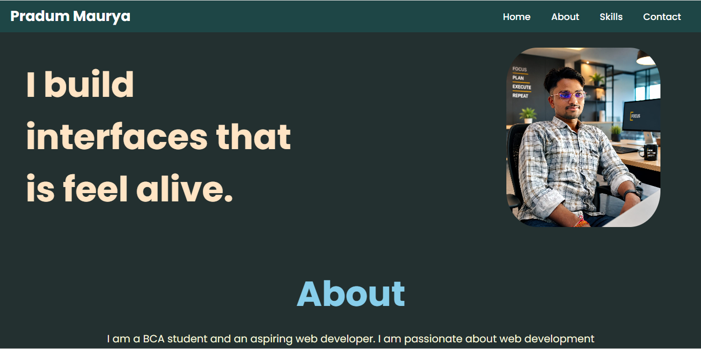
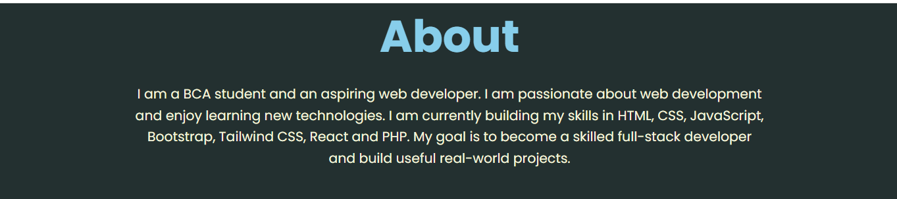
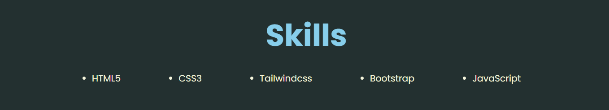
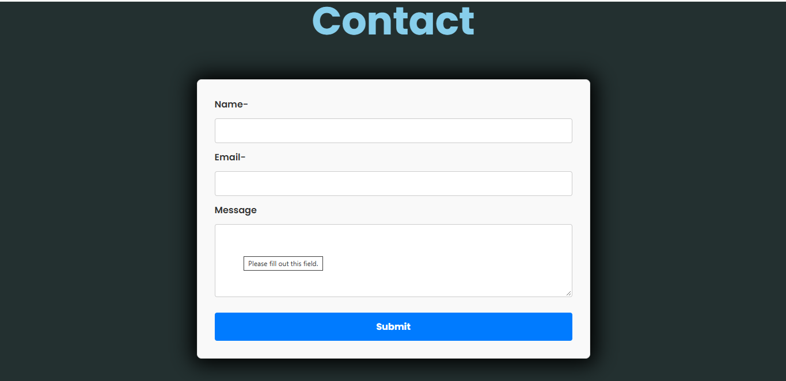
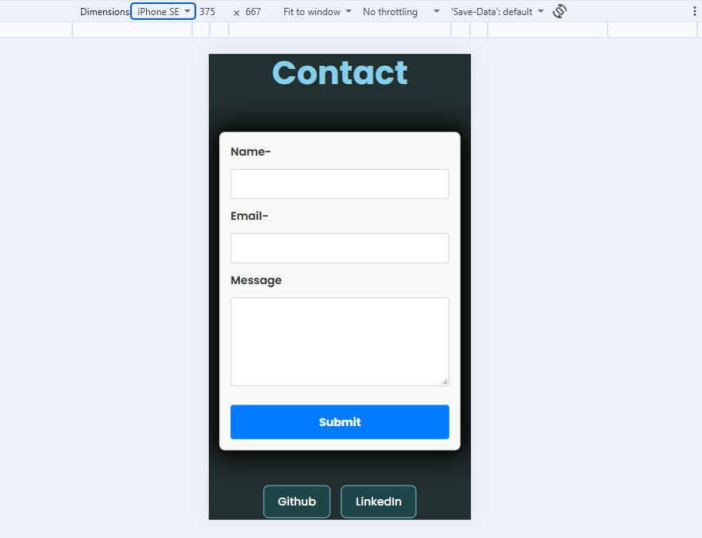
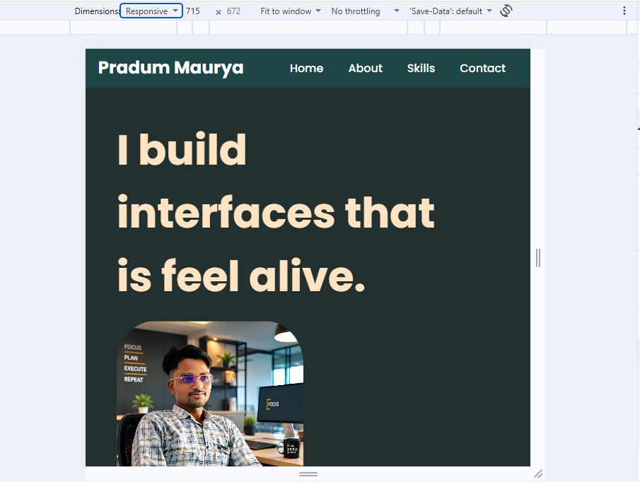

# Personal Portfolio Website

## Project Overview

This project is a personal portfolio website created using HTML5 and CSS3.

The purpose of this portfolio is to showcase my personal information,
skills, profile picture, social links, and contact details in a simple,
styled, and responsive webpage.

The project was developed as part of my web development learning and
internship tasks, covering HTML5 structure and CSS3 styling concepts.

## Features

- Home section
- About Me section
- Skills section
- Contact form
- Internal navigation menu
- Profile image
- GitHub and LinkedIn links
- HTML form validation
- Semantic HTML5 structure
- External CSS stylesheet
- Custom Google Font
- Custom color scheme using CSS variables
- Responsive navigation
- Responsive layout for mobile devices
- Hover effects
- CSS transitions
- Hero section animation
- Image hover effect
- Form input focus effects
- Responsive contact form
- Flexbox layout
- CSS Grid layout
- Smooth scrolling

## Technologies Used

- HTML5
- CSS3
- Google Fonts
- Flexbox
- CSS Grid
- CSS Media Queries

## CSS Concepts Used

The website uses an external `style.css` file for styling.

The following CSS concepts are implemented:

- CSS reset
- CSS variables
- Element selectors
- Class selectors
- ID selectors
- Pseudo-classes
- `:hover`
- `:focus`
- Flexbox
- CSS Grid
- Margin and padding
- Borders and border-radius
- Box shadows
- Transitions
- Keyframe animation
- Media queries
- Responsive design
- Custom fonts
- Background and text colors

## Project Structure

```text
Personal-Portfolio/
│
├── index.html
├── style.css
├── README.md
│
├── images/
│   └── Profilepic.jpeg
│
└── screenshots/
    ├── Home.png
    ├── About.png
    ├── Skill.png
    ├── Contact.png
    ├── MobileRes.png
    └── TabletRes.png

```md
## Screenshots

Screenshots of the portfolio website are included below as visual documentation of the project.

### Home Section



### About Section



### Skills Section



### Contact Section



### Mobile Responsiveness



### Tablet Responsiveness

