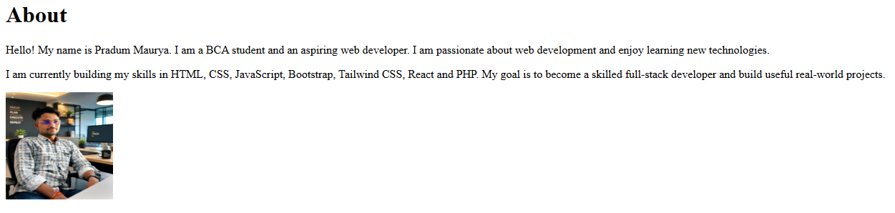
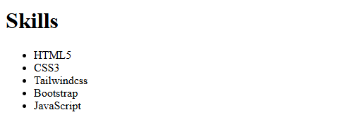
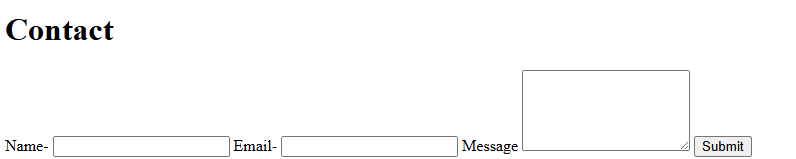
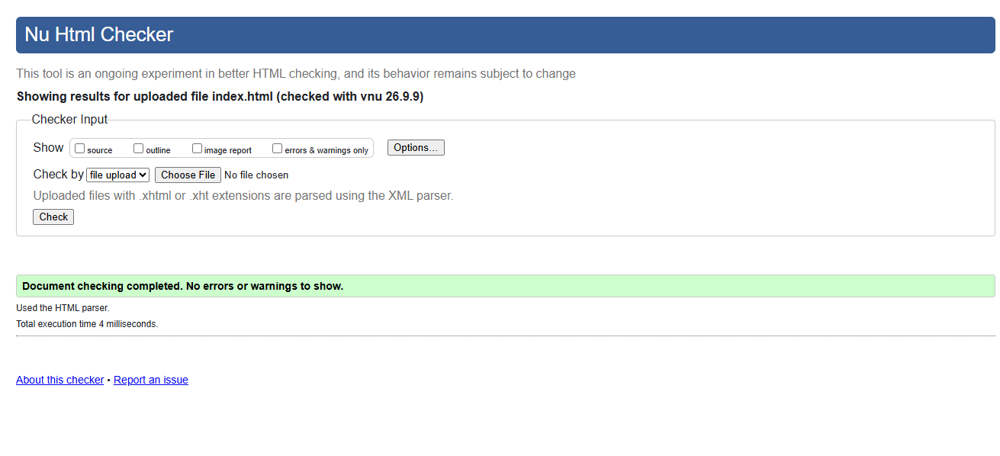

# Personal Portfolio Website

## Project Overview

This project is a personal portfolio website created using HTML5.

The purpose of this portfolio is to showcase my personal information,
skills, profile picture, social links, and contact details in a simple
and structured webpage.

## Features

- About Me section
- Skills section
- Contact form
- Internal navigation menu
- Profile image
- GitHub and LinkedIn links
- HTML form validation
- Semantic HTML5 structure

## Technologies Used

- HTML5

## Project Structure

Personal-Portfolio/
   index.html
   README.md
   images/
      Profilepic.jpeg
   screenshots/
      home.png
      about.png
      skill.png
      contact.png
## How to Run
1. Download or clone this repository.
2. Open the project folder.
3. Open index.html in any modern web browser.
4. The portfolio website will be displayed in the browser.

## Testing
The website was tested in a web browser to verify:
- Navigation links work correctly.
- Internal section links navigate to the correct sections.
- Profile image is displayed correctly.
- GitHub and LinkedIn links work correctly.
- Contact form fields are required.
- Email field accepts a valid email format.
- HTML structure was checked for errors.

## Technical Details

### Architecture

This project uses a simple static webpage architecture based on HTML5.

The website is structured using semantic HTML elements such as:

- header
- nav
- main
- section
- footer

### Algorithms and Data Structures

No specific algorithms or complex data structures are used in this
project because it is a static HTML website.

## Screenshots

Screenshots of the portfolio website are included below as visual documentation of the project.

### Home Section

### About Section

### Skills Section

### Contact Section

### HTML Validation

The HTML document was validated successfully with no errors or warnings.